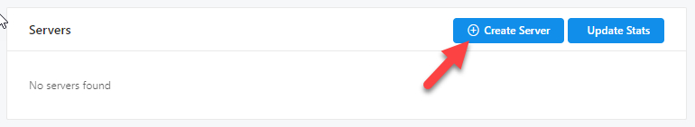
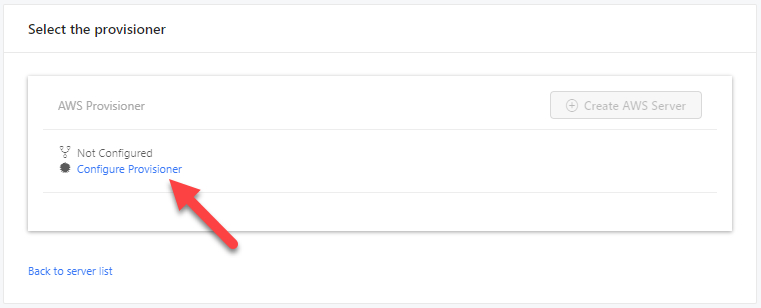
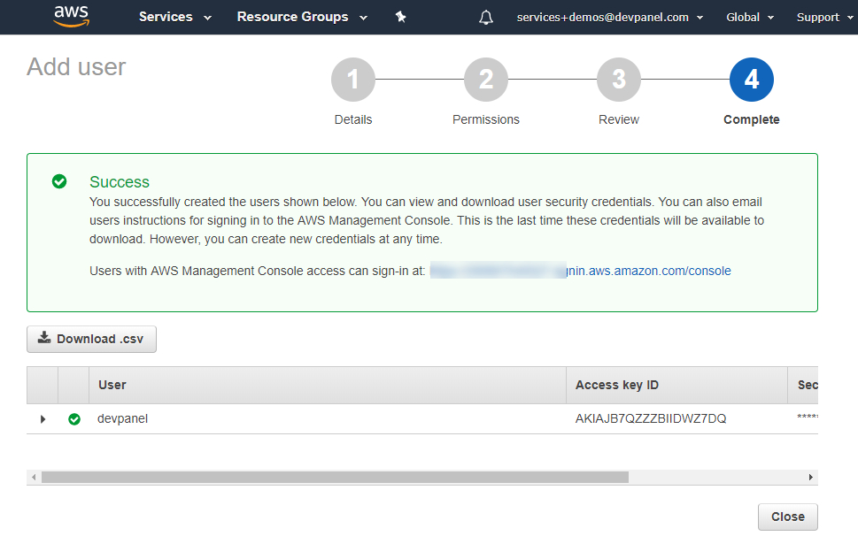
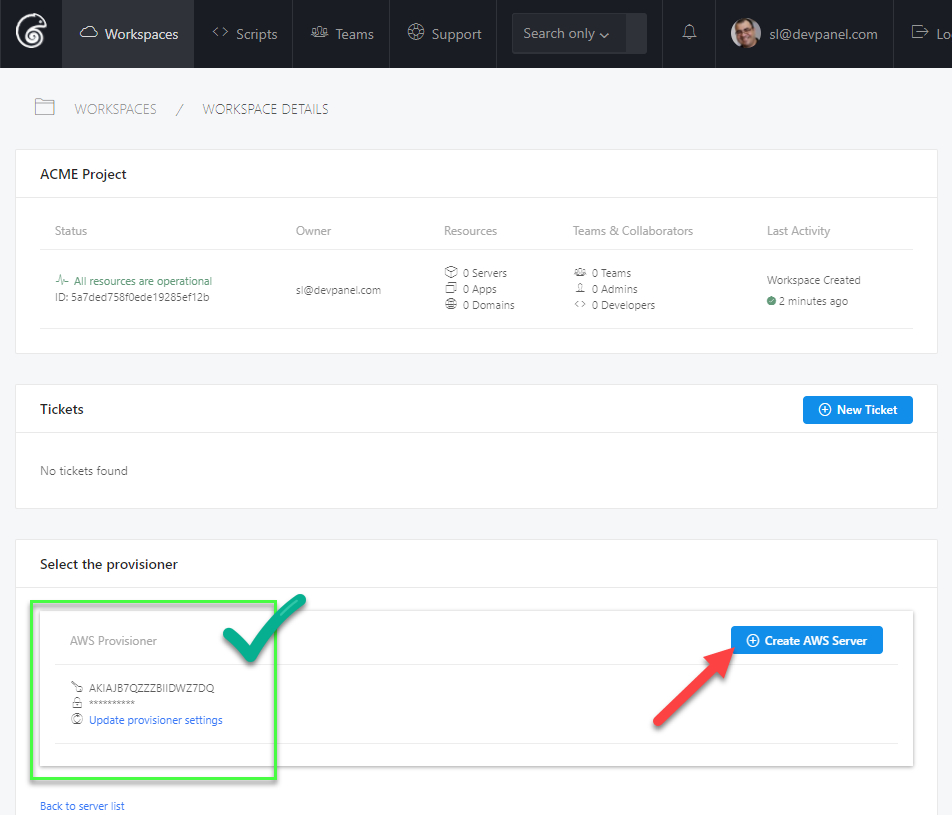

1. In a devPanel Workspace, click "Create Server".

2. Note that the "Create Server" button is now disabled... that's because the Provisioner is not configured yet.

3. Let's configure the Provisioner next... click "Configure Provisioner".

4. Your page will look like this.

Leave this page as is for now.

5. Login to your AWS Console and select IAM service.

6. Click on Users.

7. Click on Add user button.

8. Enter a user name, for example "devpanel"; Give it Programmatic access and click Next.

9. Under the "Add user to group", search and select the "admin" group, click Next.

10. Review and make sure everything looks right… then click Next.

11. You should get a Success message.

12. Copy and paste the Access key and Secret key from AWS to devPanel.

13. Click the Save button on devPanel.

14. Click the Close button on AWS.

15. Your Provisioner is now setup on devPanel and you're now free to create a server in your Workspace.

