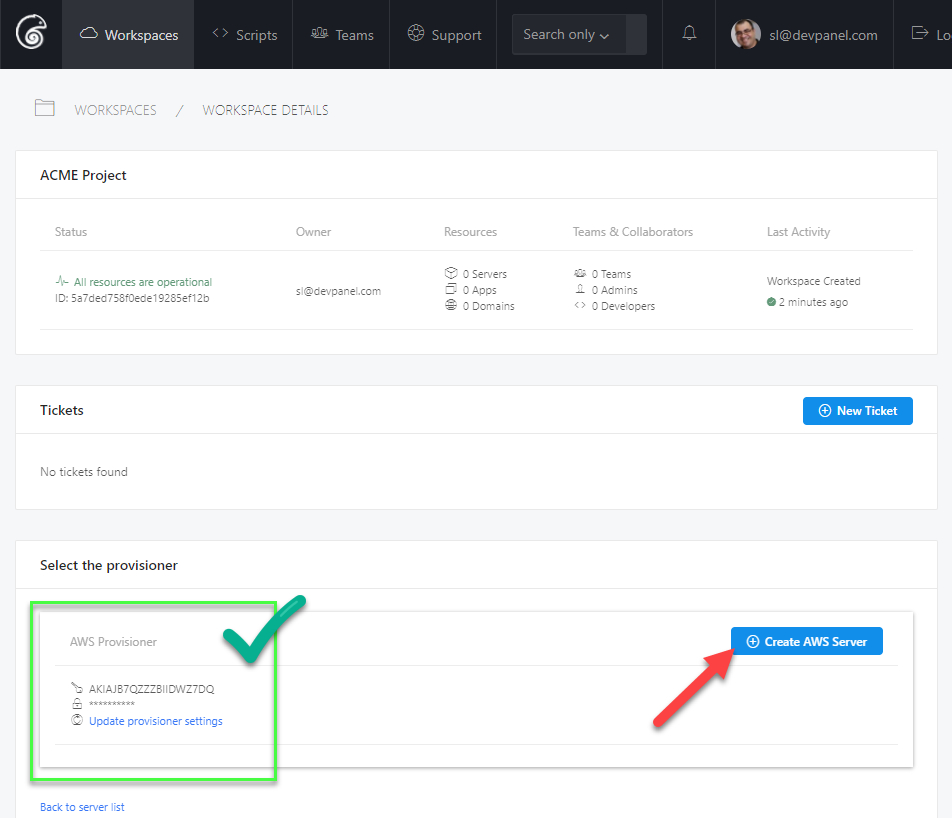
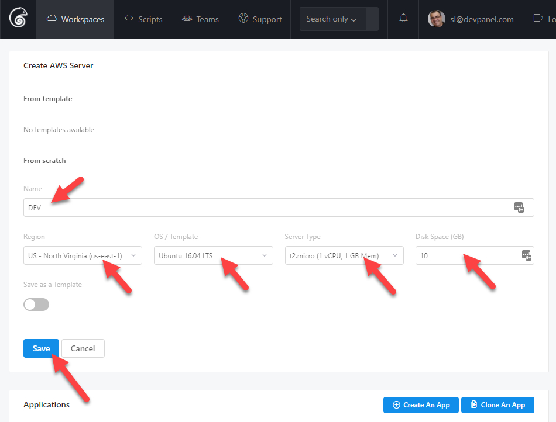
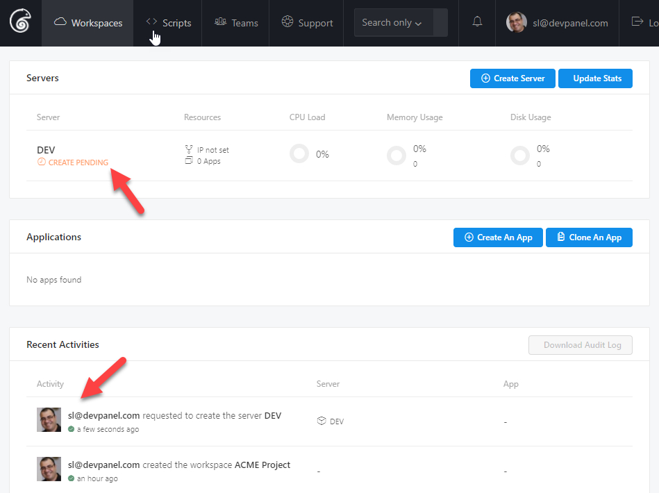
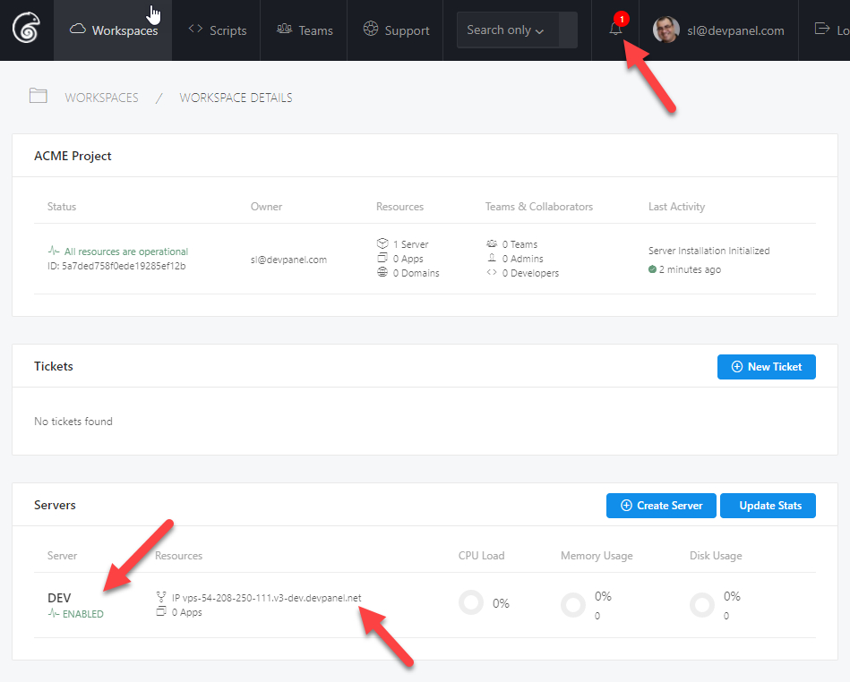
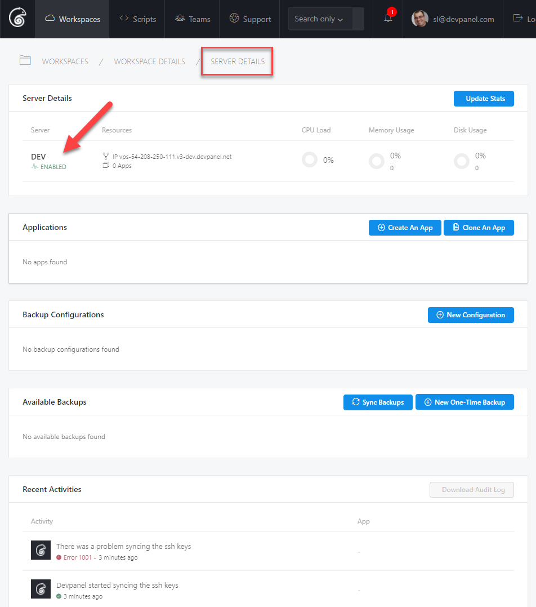

1. Once your Provisioner is setup on devPanel, click on Create Server.

2. Fill in your server specs and click Save.

    > TIP: Select at least 8 GB for the Disk Space

3. You'll see that the server is in "Create Pending" state and you can see the activity log under Recent Activities.

4. When the server is built, you'll get notified and the server will show as "Enabled" and devPanel will show you the address of the server.

5. You can now click on the server name to manage the server; this is what the server details page should look like:

6. You're now done creating your server; next we'll look at how to create an application.
