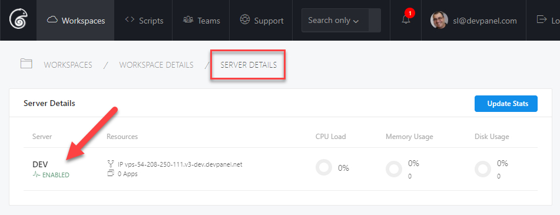
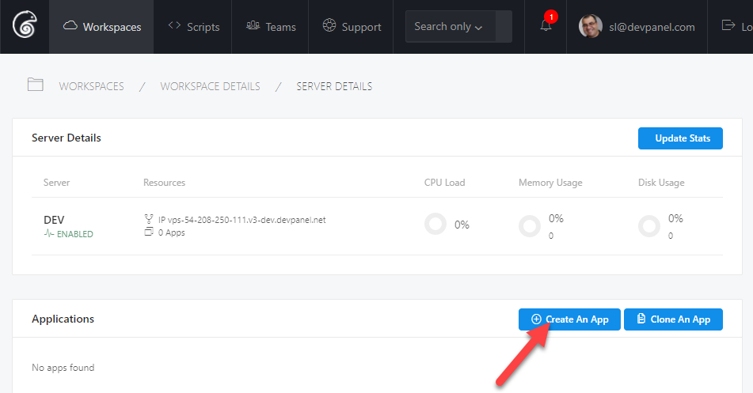
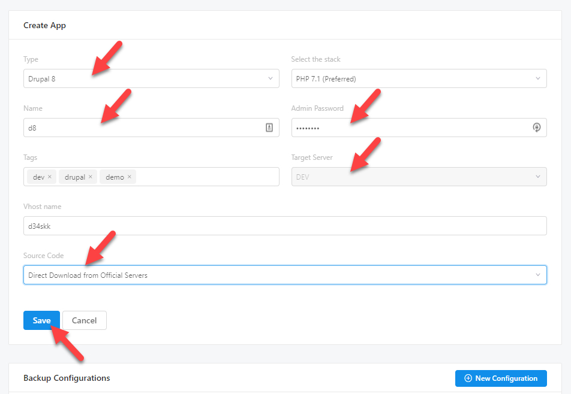
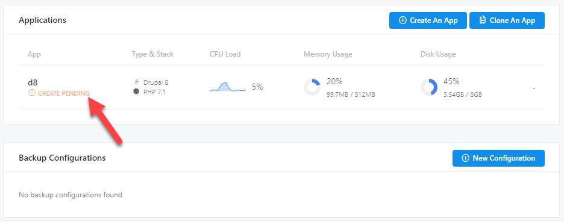
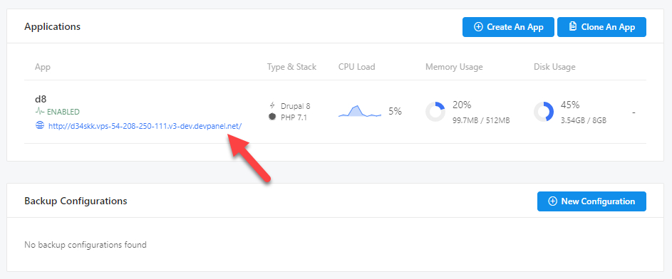
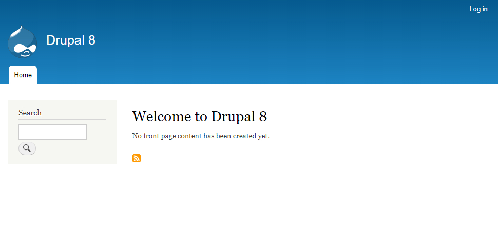

1. Go to your server details page.

2. Click on Create an App under Applications.

3. Fill in the details on the Create App form and click Save.

    > TIP: remember the admin password… you'll need it later to login as admin in your app

4. devPanel will now show the application in "Create Pending" state.

5. Once the application is created, you'll be notified and devPanel will show you the URL to the application.

6. Clicking on the URL will take you to the application.

    > TIP: test your "admin" access and set your admin email right away

